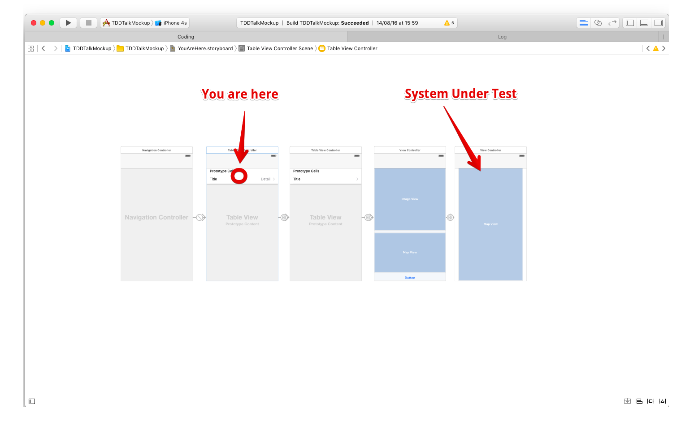

# Test-Driven iOS Development with Swift
Dominik Hauser, *@swiftpainless*

---

# Three rules (Uncle Bob)
- You are *not allowed to write any production code* unless it is to pass a failing unit test
-  You are *not allowed to write any more of a unit test* than is sufficient to fail; and compilation failures are failures
- You are *not allowed to write any more production code* than is sufficient to pass the one failing unit test

---

# Red, Green, Refactor

**Red**: Write a *failing* test

**Green**: Write the *simplest* code that makes the test pass

**Refactor**: Improve the code *without breaking* the tests

---

# Why Unit Tests?

---

---

# Why Unit Tests?
- Fast feedback

---

---

# Why Unit Tests?
- Fast feedback
- Edge cases

---

---

# Why Unit Tests?
- Fast feedback
- Edge cases
- Regression

---

# Why TDD?

---

# Why TDD?

- Automatic testability
- Automatic modularity
- High test coverage
- Refactoring
- Living documentation

---

# Keep in mind

--- 

# Keep in mind

- No silver bullet
- Slower at first
- Training curve

---

# 🤓 Live Coding 🤓

